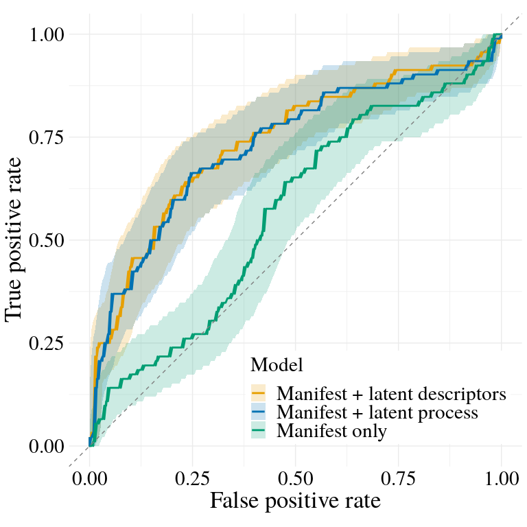

Partially observable predictor models for identifying cognitive markers
================
2025-02-19

- [Load processed results](#load-processed-results)
- [Define colors for models](#define-colors-for-models)
  - [Cross-Validation Results](#cross-validation-results)
    - [ROC Curves](#roc-curves)
    - [AUC Results](#auc-results)
  - [Full Information Results](#full-information-results)

# Load processed results

# Define colors for models

## Cross-Validation Results

### ROC Curves

<!-- -->

### AUC Results

|               | Model                         | AUC                    | Folds |
|:--------------|:------------------------------|:-----------------------|------:|
| manifest      | Manifest only                 | 0.565 \[0.495, 0.635\] |    10 |
| descriptive   | Manifest + latent descriptors | 0.738 \[0.673, 0.803\] |    10 |
| process_model | Manifest + latent process     | 0.730 \[0.664, 0.797\] |    10 |

Cross-validation AUC results with 95% confidence intervals

## Full Information Results

    ## 
    ## 
    ## Table: Coefficient estimates for Manifest only
    ## 
    ## |             |   mean|    sd| q2.5.2.5%| q97.5.97.5%|
    ## |:------------|------:|-----:|---------:|-----------:|
    ## |coeff_age    |  0.279| 0.123|     0.039|       0.518|
    ## |coeff_gender | -0.235| 0.262|    -0.747|       0.278|
    ## |coeff_educ   |  0.072| 0.135|    -0.194|       0.339|
    ## |coeff_black  |  0.679| 0.272|     0.155|       1.211|
    ## |coeff_hisp   |  0.452| 0.394|    -0.323|       1.229|
    ## 
    ## 
    ## Table: Coefficient estimates for Manifest + latent descriptors
    ## 
    ## |             |   mean|    sd| q2.5.2.5%| q97.5.97.5%|
    ## |:------------|------:|-----:|---------:|-----------:|
    ## |coeff_ssa    |  0.705| 0.172|     0.378|       1.050|
    ## |coeff_sss    |  0.515| 0.649|    -0.759|       1.801|
    ## |coeff_age    |  0.183| 0.129|    -0.070|       0.436|
    ## |coeff_gender | -0.244| 0.272|    -0.776|       0.298|
    ## |coeff_educ   |  0.160| 0.138|    -0.112|       0.434|
    ## |coeff_black  |  0.433| 0.281|    -0.117|       0.991|
    ## |coeff_hisp   |  0.269| 0.403|    -0.524|       1.045|
    ## 
    ## 
    ## Table: Coefficient estimates for Manifest + latent process
    ## 
    ## |                     |   mean|    sd| q2.5.2.5%| q97.5.97.5%|
    ## |:--------------------|------:|-----:|---------:|-----------:|
    ## |coeffMCIAsymptote    |  0.643| 0.230|     0.195|       1.100|
    ## |coeffMCIIIV          |  0.838| 0.573|    -0.270|       1.993|
    ## |coeffMCIGain         | -0.033| 0.163|    -0.359|       0.283|
    ## |coeffMCILearning     | -1.405| 0.610|    -2.616|      -0.229|
    ## |coeffMCIAge          |  0.192| 0.137|    -0.077|       0.460|
    ## |coeffMCIGender       | -0.194| 0.284|    -0.748|       0.372|
    ## |coeffMCIEduc         |  0.190| 0.145|    -0.092|       0.475|
    ## |coeffMCIEthnic_Black |  0.485| 0.293|    -0.088|       1.065|
    ## |coeffMCIEthnic_Hisp  |  0.292| 0.416|    -0.530|       1.095|
